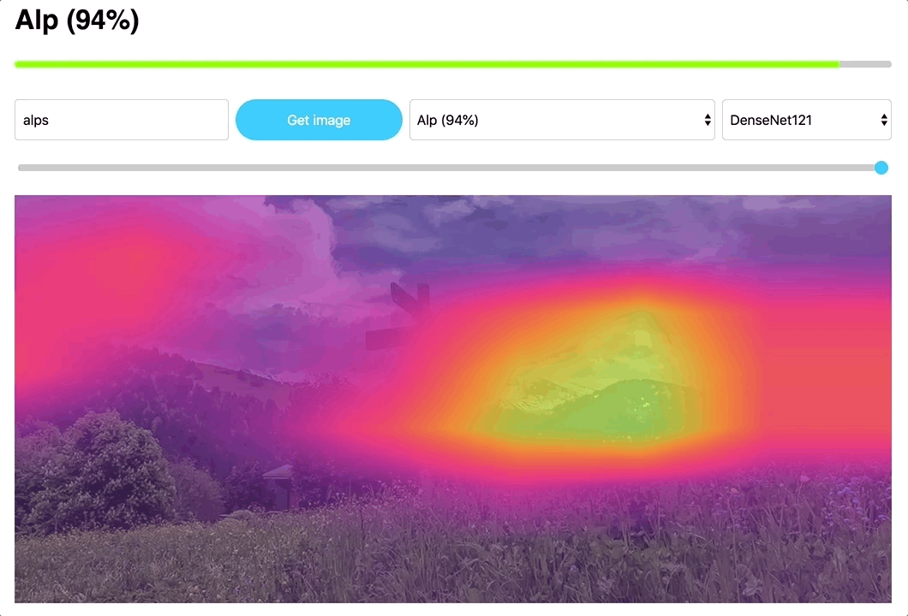

# tfjs-gradcam 
**Grad-CAM implementation in TensorFlow JS.**

[
  
  Try it out in your browser.
](https://carlthome.github.io/tfjs-gradcam/)

## Grad-CAM
Gradient-weighted Class Activation Mapping (Grad-CAM) is a technique for producing "visual explanations" for decisions from a large class of CNN-based models, making them more transparent. The gradients of the target concept flow into the final convolutional layer to produce a coarse localization map highlighting the important regions in the image for predicting the concept.

Selvaraju, R. R., Cogswell, M., Das, A., Vedantam, R., Parikh, D., & Batra, D. (2016). Grad-cam: Visual explanations from deep networks via gradient-based localization. See https://arxiv.org/abs/1610.02391 v3, 7(8).

